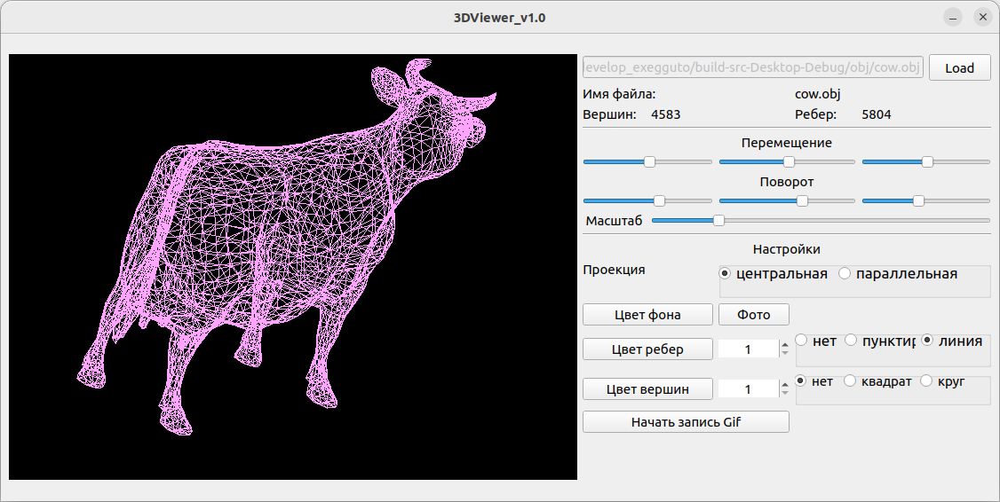

# Разработать программу 3D Viewer

## Chapter I

## Introduction

В данном проекте Вам предстоит реализовать на языке программирования Си программу для просмотра 3D моделей в каркасном виде (3D Viewer). Сами модели необходимо загружать из файлов формата .obj и иметь возможность просматривать их на экране с возможностью вращения, масштабирования и перемещения.

## Part 1. 3DViewer

Разработать программу для визуализации каркасной модели в трехмерном пространстве:

- Программа должна быть разработана на языке Си стандарта C11 с использованием компилятора gcc.
- Сборка программы должна быть настроена с помощью Makefile со стандартным набором целей для GNU-программ: all, install, uninstall, clean, dvi, dist, tests, gcov_report. Установка должна вестись в любой другой произвольный каталог
- Должно быть обеспечено покрытие unit-тестами модулей, связанных с загрузкой моделей и аффинными преобразованиями
- Программа должна предоставлять возможность:
    - Загружать каркасную модель из файла формата obj (поддержка только списка вершин и поверхностей).
    - Перемещать модель на заданное расстояние относительно осей X, Y, Z.
    - Поворачивать модель на заданный угол относительно своих осей X, Y, Z
    - Масштабировать модель на заданное значение.
- В программе должен быть реализован графический пользовательский интерфейс, на базе GUI-библиотеки Qt
- Графический пользовательский интерфейс должен содержать:
    - Кнопку для выбора файла с моделью и поле для вывода его названия.
    - Зону визуализации каркасной модели.
    - Кнопку/кнопки и поля ввода для перемещения модели. 
    - Кнопку/кнопки и поля ввода для поворота модели. 
    - Кнопку/кнопки и поля ввода для масштабирования модели.  
    - Информацию о загруженной модели - название файла, кол-во вершин и ребер.
- Программа должна корректно обрабатывать и позволять пользователю просматривать модели с деталями до 100, 1000, 10 000, 100 000, 1 000 000 вершин без зависания (зависание - это бездействие интерфейса более 0,5 секунды).

## Part 2. Дополнительно. Настройки

 - Программа должна позволять настраивать тип проекции (параллельная и центральная)
 - Программа должна позволять настраивать тип (сплошная, пунктирная), цвет и толщину ребер, способ отображения (отсутствует, круг, квадрат), цвет и размер вершин
 - Программа должна позволять выбирать цвет фона
 - Настройки должны сохраняться между перезапусками программы

 ## Part 3. Дополнительно. Запись

 - Программа должна позволять сохранять полученные ("отрендеренные") изображения в файл в форматах bmp и jpeg
 - Программа должна позволять по специальной кнопке записывать небольшие "скринкасты" - текущие пользовательские аффинные преобразования загруженного объекта в gif-анимацию (640x480, 10fps, 5s)

## Preview

Проверка успешности сборки по команде make install отсуществлялась на MacOs и Ubuntu

